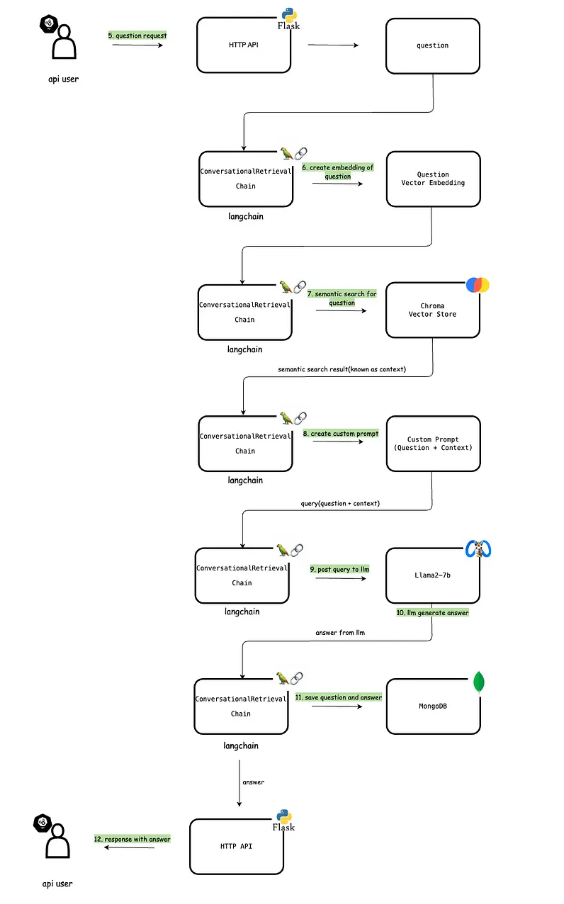

# local ChatBot
based on [link](https://medium.com/rahasak/session-based-chatbot-for-website-content-utilizing-openai-gpt-4-llm-langchain-ef09e0706767)
To run the large language model with more privacy, no leaky of personal data, download the llm and run it locally.
## Ollama
a lightweight and flexible framework for local deployment of LLM. Provide a collection of pre-configured models. it quantize the neural network to make it applicable for personal computers
## RAG(Retrieval Augmented Generation)
incorporates a custom-made dataset, can also dynamically scraped from an online website, user interacte with website's date through API. Document -> scrap -> split -> store in Chorma vector database as vector embeddings
### Web-Scrabble
#### Data Indexing
Web <- scrape web - RecursiveUrlloader((langchain) -> scraped documents -> RecursiveCharacterText Spliter(Langchain) - split documents -> Chunks -> HuggingfaceEmbedding(langchain) - create vector embedding ->Vector Embedding -> HuggingfaseEmbedding(langchain) - save vector embeddings -> Chroma vector Store
* Scrape Web Data: different document loaders from langchain, e.g. ResursiveUrlLoader is to scrape data from the web as documents
* Split Documents: divide the text into smaller segments, the langchain text splitter divides the text into small semantically meaningful units
* Create Vector Embedding: Convert the texual information into vector embeddings, easy to be grouped, sorted, searched and more
*  Store Vector Embedding in Chroma: ChromaDB is an opensource embedding database, allows for quick retrieval and comparison of text-based data
#### Data Querying
 
* Semantic Search Vector Database: semantically search through the vector database and find out the most relevant content to the user's query
* Save Query and Response in MongoDB Chat History: to manage conversational memory, the history data is essential in shaping future interactions
### Complex PDF 
#### PDF Processing
The first thing to create a multimodel retriver is to separate the pdf into 'text', 'images' and 'tables'.
##### LlamaParse (Cloud-Dependent)
LlamaParse is designed for complex documents which contains figures and tables. Llamaparse does its work by extracting data from these documents and transforming them into easily ingestible formats such as markdown or text. 
+ **Supported file types**: PDF, .pptx, .docx, .rtf, .pages, .epub, etc...
+ **Transformed output types**: Markdown, text.
+ **Extraction Capabilities**: Text, tables, images, graphs, comic books, mathematics equations
##### Unstructured.io
Specialiting in extracting and transforming complex data from different formats. It transforms information in the documment into AI-friendly JSON files. For example in PDFs, it can partitial the documents based on their content types, like header, image, list and table, and chunk by their titles. 

**Process:**
    + **Partition**: Extracts content from raw files and outputs that content as structured document elements. 
    + **Chunking**: After partition, chunking can rearrange the documents into some smaller size 'chunks', so that the limitation of embedding models can be fulfilled and the precision is improved. By chunking, UNSTRUCTURED offers by-title, by-page and by-similarity strategies, so that people can get more control of chunking phrase. After chunking, it willget document elements with types like: ```CompositeElement```(all text elements will become a ```CompositeElement``` after chunking), ```Table```(not combined with other elements) and ```TbaleChunk```(Large tables will be split according to the *Max Characters*)
    + **Enriching**: Enriching enhances the data via summarizing images and tables, representing table in HTML markup format and Named Entity Recognition(NER).
    + **Embedding**: Create a vector database which can be used in similarity search.


#### Image Processing
+ **Llava** 
## Implementation
### Configurations
in the [config.py](./config.py) file are some configurations which are reas through environment variables
### HTTP AI 
HTTP API is carried ou in [api.py](./api.py). This API includes an HTTP POST endpoint ```api/question```, which accepts a JSON objact containing a question and user_id
## Models
includes scraping data from website and creating vector store in ```init_index()``` and available the Llama3 LLM through the Ollama's model REST API ```<host>_11434``` in function ```init_conversation```. The ```chat``` function is responsible for posting questions to LLM.
### Auto Classes
Hugging Face provides a wide range of Auto Classes that are designed to automatically load the correct model architecture for a specific task based on the model type. 
```AutoModel```:
+ **Purpose**: Loads the base transformer model without any task-specific heads.
+ **Use Case**:  If only want to use the base model for extracting embeddings, use this class.
+ **Example**:
    ```
    from transformers import AutoModel, AutoTokenizer
    
    model_name = "bert-base-uncased"
    model = AutoModel.from_pretrained(model_name)
    tokenizer = AutoTokenizer.from_pretrained(model_name)
    ```

```AutoModelForCausalLM```:
+ **Purpose**: Loads a model for causal language modeling (autoregressive text generation).
+ **Use Cases**: This is useful for text generation tasks where you need to predict the next word in a sequence, such as chatbots, text generation, or language modeling.

```ÀutoModelForSeq2SeqLM```:
+ **Purpose**: Loads a model for sequence-to-sequence tasks, such as translation or summarization.
+ **Use Cases**: Translation and Summarization


```ÀutoModelForQuestionAnswering```:
+ **Purpose**: Loads a model specifically for question answering tasks, where the model predicts the start and end positions of the answer in a context.
+ **Use Cases**: This is used for extractive question answering tasks where a question is asked and the model needs to extract the answer from a given context.
+  **Example**:
    ```
    from transformers import AutoModelForQuestionAnswering, AutoTokenizer
    model_name = "bert-large-uncased-whole-word-masking-finetuned-squad"
    model = AutoModelForQuestionAnswering.from_pretrained(model_name)
    tokenizer = AutoTokenizer.from_pretrained(model_name)
    inputs = tokenizer(question, context, return_tensors='pt')
    outputs = model(**inputs)
    
    # Get the logits for the start and end positions
    start_logits = outputs.start_logits
    end_logits = outputs.end_logits
    
    # Find the token with the highest score for the start and end positions
    answer_start = start_logits.argmax()
    answer_end = end_logits.argmax()
    
    answer = inputs["input_ids"][0][answer_start:answer_end+1]
    print(tokenizer.decode(answer))
    ```
### Quantization
Quantization is a model compression technique that reduces the size and memory footprint of the LLM, making it more efficient to deploy and run on resource-constrained devices. It involves reducing the precision of the model's weights and activations, typically from 32-bit floating-point to 8-bit or lower, without significantly impacting the model's performance.
```
bnb_config = BitsAndBytesConfig(
    load_in_4bit=True,
    bnb_4bit_use_double_quant=True,  # Use double quantization to reduce memory usage
    bnb_4bit_quant_type='nf4', # Use NF4 (Normal Float 4-bit) quantization
    bnb_4bit_compute_dtype=torch.bfloat16  #  Use bfloat16 for computation to save memory
)
model = AutoModelForCausalLM.from_pretrained(model_name, device_map='auto', quantization_config=bnb_config)
```
### ONNX(Open Neural Network Exchange)
ONNX is an open format designed for model interoperability and optimized inference across various frameworks and hardware platforms. It allows models trained in one framework (like PyTorch or TensorFlow) to be exported and run in an efficient, hardware-agnostic way using highly optimized runtimes.

**Key Features**:
+ Interoperability: Models trained in frameworks like PyTorch, TensorFlow, or Keras can be converted to ONNX format and deployed with ONNX-compatible runtimes.
+ Optimized Inferences:
    * ONNX runtimes, like ONNX Runtime or TensorRT, optimize computations for specific hardware (e.g., CPUs, GPUs, TPUs).
    * ONNX models often achieve lower latency and faster execution compared to their original framework, especially on CPUs.
+ Hardware Support: Supports CPUs, GPUs, FPGAs, and specialized accelerators (e.g., NVIDIA TensorRT, Intel OpenVINO).
+ Comptibility: ONNX is supported by major deep learning libraries and tools, enabling seamless integration into workflows.

**Workflow**:
```
# a simple input for the model, so the input can go through the model, and then with the trace from PyTorch the corresponding graph will be stored as ONNX model
x = torch.randn(1, 3, 256, 256) 
 
with torch.no_grad(): 
    torch.onnx.export( 
        model, 
        x, 
        "srcnn.onnx", 
        opset_version=11, 
        input_names=['input'], 
        output_names=['output'])

# Load the model
onnx_model = onnx.load('srcnn.onnx')
# check if the model file is correct
try:
    onnx.checker.check_model(onnx_mode)
except Exception:
    print('Model incorrect')
```
#### ONNX Runtime
ONNX Runtime is a high-performance inference engine for ONNX models. It is optimized for speed and efficiency, making it ideal for deploying machine learning models in production.

**Key Features**:
+ Cross-Platform Support
+ Performance Optimizations: Uses graph optimizations, such as constant folding and operator fusion, to accelerate inference.
+ Scalability: Designed to handle models from simple linear regression to complex deep learning architectures.
+ Interoperability
+ Extensibility
+ Prebuild packages

**Workflow**:
```
import onnxruntime as ort
seddion = ort.InferenceSession("srcnn.onnx")
ort_inputs = {'input': input}
ort_outputs = session.run(['output'],ort_inputs)[0]  
```
## Fine-Tuning
Fine-Tuning is a machine learning process where a pre-trained model is further trained on a specific task or dataset to adapt it to a particular use case. 
+ Take a pre-trained model
+ Training on a smaller, task-specific dataset
+ Adjusting the pre-trained weights

### vLLM
vLLM is an open-source project taht allows people to do LLM inference and serving. This means that you can download model weights and pass them to vllm to perform inference via API

### PEFT(Parameter-Efficient Fine-Tuning)
PEFT optimizes fine-tuning by updating only a small subset of model parameters. Since full fine-tuning needs to update all model parameters during supervised learning, so it may has several challenges like **Memory-Intensive Requirements**, **Catastrophic Forgetting**(forget previouse knowledge when having a new task), **Storage and Computational Costs**. In order to avoid the above problems, PEFT seeks to update only a small subset of the model parameters, making the fine-tuning processe more manageable. 
#### LoRA(Low-Rank Adaptation)
LoRA is a powerful PEFT technique which is introduced to address the high computational cost and memory requirements typically associated with Fine-Tuning large models. Achieving by adapting only a small subset of the model's parameters, rather than Fine-Tuning all parameters.

**Main Concept**
+ Instead of updating a large matrix directly, it uses two smaller matrices, which means: the weight matrix $N x M$ &rarr; $N x K$ & $K x M$ where $K$ is usually small.
+ For smaller models, LoRA may not increase the model performance outstandingly, but its effectiveness increases as model size grows.
+ ```
  lora_config = LoraConfig(
    r=8,  # Rank of the low-rank matrices
    lora_alpha=32,  # Scale factor for the low-rank matrices
    target_modules=['query_key_value'],  # Modules to apply LoRA to
    lora_dropout=0.1,  # Dropout rate for the low-rank matrices
    bias='none',  # Bias mode ('none', 'all', 'lora')
    task_type='CAUSAL_LM'  # Task type ('CAUSAL_LM', 'SEQ_2_SEQ_LM', 'TOKEN_CLASSIFICATION', 'QUESTION_ANSWERING'))
  peft_model = get_peft_model(original_model, lora_config) 

**QLoRA**: Q stands for quantization i.e. the process of reducing the precision of numerical representations of weights, activations or data, so QLoRA stands basically for LoRA over quantized LLM, i.e. LLM loaded using a lower precision datatype in the memory.

#### Prompt Tuning

### Reinforcement
Reinforcement learning (RL) is a popular method to enhance the capabilities of large language models (LLMs).

**Process**
+ The model generates responses to a prompt, which are then evaluated by a human or another model.
+ A reward function is trained with supervised learning (a data set with scores to the response (positive for desirable behavior, negative for undesirable)).
+ Use reward learning in the reinforcement learning loop to fine-tuning the base LLM. 
**PPO(Proximal Policy Optimization)**
  
**Reward Model**
+ Reward model provides feedback to LLMs to help them understand which answer is expected and which are not.
+ It takes (prompt, response) pair as input and outputs a reward/score as output and this process can be formulated as a simple regression or classification task.
+ Common Approach: TRL Custom Reward Modeling 

